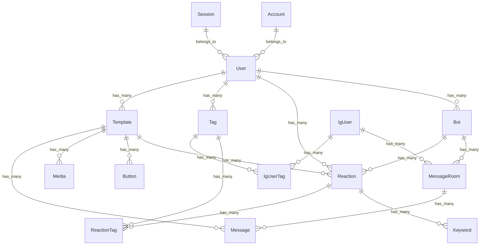

# 開発者向け

## パッケージインストール

```bash
yarn
```

## 環境変数設定

`.env` をルートディレクトリに作成し、それぞれの中身はリクエストしてください。

## 作業ブランチ

`develop`ブランチから、ブランチを切ってください。
ブランチ命名
新機能追加 `feat/hoge`
バグ修正 `fix/hoge`

## ローカルサーバー起動

```bash
yarn dev
```

<br />
<br />

# 利用者向け


<br />

## サービスの URL

数クリックで Google で登録・ログインできるので、お気軽にお試しください。

https://idm-reply.com

<br />

## サービス開発の経緯

私は現在、Instagram を通した情報発信を行なっています。
その中で、フォロワーさんにさまざまな特典や資料などをお配りすることが多いです。
その際、Instagram の投稿には URL を添付することができないので、
DM で送信することが多いです。
DM を送る作業は、始めは良かったですが、フォロワーさんが増えてくるとだんだん作業量が膨大になり、大変になってきました。
そこで、DM を送る作業を自動化したいと思いました。
すでに、Instagram の DM 自動かのサービスは世の中にありましたが、
料金が安くても月額２ 2,000 円など、払い続けられる額ではありませんでした。
そこで、自分で開発をしたのが iDM です。

<br />

## 機能一覧

| トップ画面                                                                                      | 　ログイン画面                                                                  |
| ----------------------------------------------------------------------------------------------- | ------------------------------------------------------------------------------- |
|                                                            |                                             |
| トップページ(/)を LP の構成にし、訪問者がサービスの内容を理解し、登録してもらいやすくしました。 | Google ログインを実装し、数クリックで登録 or ログインが完了するようにしました。 |

| 自動返信一覧画面                                                                                                                 | 自動返信設定画面                                                                             |
| -------------------------------------------------------------------------------------------------------------------------------- | -------------------------------------------------------------------------------------------- |
|                                                                                     |                                               |
| 設定中の自動返信の一覧です。稼働をすぐに止められるよう、稼働の ON/OFF を一覧ページからでもスイッチで変更できるようにしています。 | 返信するキーワードや時間条件を設定できる画面です。ニーズに合わせて細かく条件が設定できます。 |

| 返信テンプレート一覧画面                                                           | 　 返信テンプレート設定画面                                                                                              |
| ---------------------------------------------------------------------------------- | ------------------------------------------------------------------------------------------------------------------------ |
|                            |                                                                |
| 自動返信する文章の一覧表示画面です。冒頭文を表示することで、検索性を高めています。 | 自動返信する文章の設定画面です。Instagram 上でのプレビューも表示することで、稼働時のイメージもできるようになっています。 |

| タグ一覧画面                                                                                                                         | アクションを起こしたユーザー一覧画面                                                                               |
| ------------------------------------------------------------------------------------------------------------------------------------ | ------------------------------------------------------------------------------------------------------------------ |
|                                                                                               |                                                    |
| 自動返信してくれたユーザーに、タグをアタッチできるようになっています。これにより、キャンペーンへの参加者などを管理しやすくなります。 | 自動返信を行なったユーザー一覧画面です。リスト表示化することで、その後のマーケティングにも役立てることができます。 |

<br />

## 使用技術

| Category       | Technology Stack                          |
| -------------- | ----------------------------------------- |
| Frontend       | TypeScript, Next.js, TailwindCSS          |
| Backend        | TypeScript, Next.js, Prisma               |
| Infrastructure | Vercel, Supabase                          |
| Database       | PostgreSQL                                |
| Monitoring     | Sentry                                    |
| CI/CD          | GitHub Actions                            |
| Design         | Figma                                     |
| etc.           | ESLint, Prettier, Husky Jest, Git, GitHub |

<br />

## システム構成図


<br />

## ER 図



<br />

## 今後の展望

4 つのフェーズに分けて、開発を進めていきたいと考えています。

1. フェーズ 1：機能強化
   現在の機能を強化し、ユーザー体験を向上させるための改善を行います。具体的には、既存の UI/UX を見直し、直感的に操作できるようなデザインに改善します。また、各機能の操作性を向上させるための改良も行います。

2. フェーズ 2：新機能の追加
   ユーザーの要望に基づき、新たな機能を追加します。具体的には、ユーザーフィードバックや市場調査を元に、新たな価値を提供できる機能を開発・導入します。これにより、サービスの利便性と魅力を高めます。

3. フェーズ 3：パフォーマンスの最適化
   システムのパフォーマンスを最適化し、快適な操作感を提供します。具体的には、システムのレスポンス時間を短縮するための最適化を行い、ユーザーがストレスなくサービスを利用できるようにします。また、データの読み込み速度や処理速度も向上させます。

4. フェーズ 4：安定性の向上
   システムの安定性を向上させ、長期的なサービス提供を目指します。具体的には、システムの耐障害性を高めるための改善を行います。また、定期的なメンテナンスを行い、システムの安定運用を確保します。これにより、ユーザーに安心してサービスを利用していただける環境を提供します。
